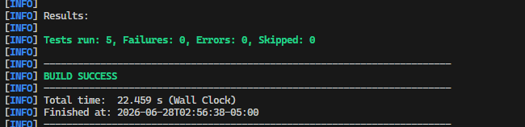
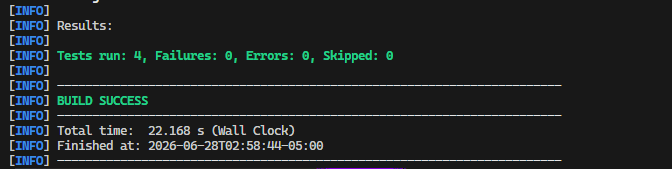

# Reto Técnico - Arquitectura de Microservicios

Este proyecto es la solución a la prueba técnica de microservicios, el cual implementa las entidades de Clientes y Cuentas bajo arquitectura hexagonal.

## Tecnologías Utilizadas
- **Java 25 (LTS)**
- **Spring Boot 4.1.x** (Con Spring Data JPA, Web, Validation)
- **Base de Datos**: H2 (Para Unit/Integration Testing) y MySQL 8.0 (Para Docker)
- **Pruebas**: JUnit 5
- **Orquestación**: Docker & Docker Compose
- **Documentación API**: Swagger / OpenAPI (Springdoc)

---

## Arquitectura y Patrones Implementados
1. **Clean Architecture (Hexagonal)**: Ambos microservicios (`clientes` y `cuentas`) separan la lógica de negocio (Dominio) de los controladores (Adaptadores Inbound) y base de datos/clientes externos (Adaptadores Outbound).
2. **Comunicación Asíncrona**: El microservicio de Cuentas se comunica con Clientes usando `@Async` y `CompletableFuture` junto a `RestClient` para obtener la información de cliente de forma asíncrona sin bloquear el hilo principal.
3. **Inmutabilidad y Auditoría**: Atributos críticos en los movimientos como `saldoInicial`, `valor` y `saldo` no pueden ser actualizados por el usuario, brindando trazabilidad completa. Además, los movimientos anulados conservan su registro (Estado: false) y generan movimientos correctivos inversos automáticamente.
4. **Endpoint Seguro**: El `numeroCuenta` se genera aleatoriamente del lado del servidor.

---

## Requisitos Previos
- Docker y Docker Compose
- Java 25 instalado en el host (si deseas ejecutar los tests nativamente)
- Maven (`mvnd` o `mvn`)

---

## 🚀 Despliegue con Docker (Requisito F7)

1. En la raíz del proyecto, asegúrate de no tener ningún otro servicio usando los puertos **3306**, **8080** y **8081**.
2. Ejecuta el comando:
   ```bash
   docker-compose up -d --build
   ```
3. Docker Compose realizará automáticamente las siguientes acciones:
   - Levantará el servidor de MySQL.
   - Cargará el script `BaseDatos.sql` (creando `clientes_db`, `cuentas_db` y todas sus tablas).
   - Levantará el microservicio **Clientes** en el puerto `8080`.
   - Levantará el microservicio **Cuentas** en el puerto `8081`.

---

## 🧪 Ejecución de Pruebas (Unitarias e Integración)

Se han implementado pruebas en JUnit 5 con Spring Boot Test para validar el comportamiento End-to-End y la lógica de negocio aislada.
Las pruebas levantarán su propio contexto en una base de datos H2 volátil, por lo que no interferirán con los contenedores de Docker.

Para ejecutar todo el set de pruebas, ingresa al directorio de cada microservicio y corre:

```bash
cd clientes
mvn clean test

cd ../cuentas
mvn clean test
```
*Si usas Maven Daemon, puedes ejecutar `mvnd clean test`.*

### Resultados de las pruebas

**Resultados del microservicio Clientes:**


**Resultados del microservicio Cuentas:**


---

## 📌 Documentación de Endpoints y Postman

Todos los endpoints tienen como prefijo obligatorio `/api` como estipulan los requerimientos.

* **Clientes**: `http://localhost:8080/api/clientes`
* **Cuentas**: `http://localhost:8081/api/cuentas`
* **Movimientos**: `http://localhost:8081/api/movimientos`
* **Reportes**: `http://localhost:8081/api/reportes`

**Validación Postman**:
El archivo `Java Microservices.postman_collection.json` se encuentra en la raíz del repositorio. Contiene todas las peticiones con los cuerpos JSON listos para ser usados.
